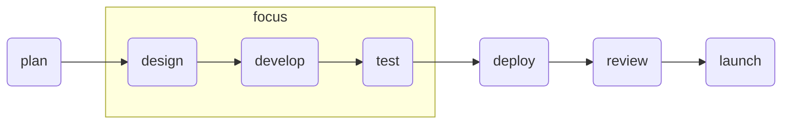
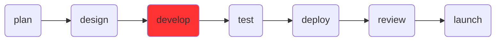

# Project Guidelines


> While you are developing a project and focusing on making the code work (which is the most important thing), you might be creating problems for maintaining, reusing and expanding for your teammates or future you. 


Table of contents:
- [Project Guidelines](#project-guidelines)
- [Initiative](#initiative)
- [Overview](#overview)
  - [What's out there?](#whats-out-there)
- [Roadmap](#roadmap)
- [pylint](#pylint)
- [Develop](#develop)
  - [Environments](#environments)
  - [code style](#code-style)
    - [Docstring](#docstring)
    - [Comment](#comment)
    - [Naming in Python](#naming-in-python)
      - [Naming Conventions](#naming-conventions)
  - [git](#git)
- [Reference](#reference)


# Initiative
It is common for a small team that uses programming lanaguage like Python for their project just like in school. But it is not uncommon that you are having extra overhead (time) when someone else is taking over your project or even the future you. 

Here is a list of problems/scenerios that you might encounter already or will encounter if you code willy-nilly:
- you finished your project and delivered result to the customer. 6 months later, a similar project that requires twisting your codebase comes to your team were asked to do it 
  - `You do it`: you have to twist the code for another similar project but you don't understand your code already due to bad documentation and comments. From a supervisor point of view, you have done similar projects already so it should be fast. On the other hand, you have to "relearn" your projects which requires additional time. It might lead conflicts.
  - `Your team do it`: you sent them the code but it doesn't have any documentation, bad or no comments which not only makes you look unprofessional but you need to devote a huge chunk of time for your colleagues to familrize with the codebase again.
- You got a new project that requires integration of multiple codebases your team have done for previous projects. Let's say you and your team have three codebases, A, B and C. 
  - developer for codebase A is gone; codebase B and C are not well documented and poorly designed that it is only creating overhead for reunderstanding codebase(imagine reading a poorly written textbook) and you can't reuse many of the methods/functions that you or they have written. 


> Note: code readbility and documentation is not formality you have to deal with for paperworks. It saves you more time and headache in the future!
 

In order to do yourself and your team a favor, you need to start thinking about styling and documentation. 

Just like many things in the world like getting the right shoe, you won't have a one-size-fit-all sort of magical shoe. We need to customize the project guideline to fit the current needs and future needs of each individual team. 

Here is some of our team meta-data:
- a team size of less than 10
- lanaguage of choice is mainly Python
- teammates work on separate projects and at most two of them will do it. 
- for most of our team's work, only functional programming is required.

endgoals our team wants:
- reusability and expandability of code
- good documentation and good styling
- managed repo with version control system like [github](https://github.com/) and [bitbucket](https://bitbucket.org/product/)
- placeholder for more in the future.

Therefore, the scope of the current project guideline is within the scope of team's metadata to fulfill our endgoals. 

# Overview

In this section, some review has been done on methodologies widely implemented in software and manufacturing companies.

## What's out there?

There are many ways of software development methodology that you probably heard of:
- DevOps (a set of best practices)
- agile (abstract)
  - Scrum (methodology 1)
  - Kanban (methodology 2)

The general DevOps workflow is illustrated in the figure below


> `DevOps`: `Dev` stands for software development and `Ops` stands for IT operations. DevOps is a methodology that combines good practices and tools to shorten the time required for developing a product-level software.

The tools listed here is just the tip of iceberg but it is overwhelming. But for small team, you don't have to worry too much about it since DevOps are for big-scale project and team.

For our team, an `agile` development approach will be preferred and the workflow is illustrated in the figure below


It basically consists of serveral sprint (multiple variation of the cycle) in order to fit customer or project's dynamic needs.


In the next section, I will list a workflow for software development methdology for small-scale team like our team. It will be a simplified version of agile.

# Roadmap

If we tailor the software development methodology to our team's needs (agile based), it would look like the following diagram but my current focus will be on design, develop and test.



Some of things, we will cover in this sections are listed in the table below

# pylint


```bash
# parsable format for reports
pylint --output-format=parseable pi_start_01182023.py

# nice little format
pylint --output-format=parseable --reports y pi_start_01182023.py
```

# Develop

In this section, I will mainly focus on best practices, tools to write high-quality code for this session.



In this section, I will cover
- [ ] environments
- [ ] code style
- [ ] git for version control

## Environments

Before starting a project, one of the first thing you should be doing is to set up an environment. After this section, you will understand
- why do we need to set up an environment for both personal use and team use?
- what's out there for python
  - conda
  - pyenv
  - pip
  - pipenv


## code style

In this section, the following topic will be discussed:
- Docstring
- Naming in Python
- Error handling


### Docstring

Docstring is one of the most important thing when writing a script in python. The general goal for the docstring is that `give enough information to write a call to the function without reading the functions'.

```python
def calculate_sum(n1, n2):
    """
    Calculates the sum of two numbers.

    Args:
        n1 (int): The first number.
        n2 (int): The second number.

    Returns:
        int: The sum of the two numbers.
    """
    return n1 + n2
```


### Comment

Typically, you can use
- `inline comment`
- `block comment`

Use block comment for explaining something complicated
```python
# for block comment

# Calculate the NDVI based on   
# red and NIR band 
# NDVI = (NIR - Red)/(NIR + RED)
```

> Writing comment is tricky but rule number one for writing comment is NEVER DESCRIBE TO CODE. 


```python
# Bad comment

# Now we iterate throught the array. 
```

### Naming in Python


High level understanding of different naming convention

|schema|description|example|
|-|-|-|
|raw|-|`user login count`|
|camel case|-|`userLoginCount = 1`|
|Pascal case|-|`UserLoginCount = 1`|
|Snake case|-|`user_login_count` for variable or `USER_LOGIN_COUNT` for constant|
|Kebab case|-|`user-login-count`|

> There is no best naming convention. Just need to be consistent within the team. And also in line with what's the most generally adopted convention.


#### Naming Conventions

> Rule # 1 for naming convention: NEVER ABBREVIATE.

- avoid single character names
  - counters or iterators (`i`, `j`)
  - `f` as a file handle and `e` for example

```python
bands = ["red", "nir","blue", "green"]

# not preferred
for i in bands:
    pass

# prefered
for band in bands:
	pass  
```

Check the table below for useful naming convention for functional programming in Python


|Type|Public|
|-|-|
|package and modules|lower_with_under|
|function/methods|lower_with_under|
|Except|CapWords|
|constant|CAPS_WITH_UNDER|
|local variable|lower_with_under|


## git


# Reference
- [project guideline for javascript projects, what serves as a good material for the guideline i am proposing](https://github.com/elsewhencode/project-guidelines)
- [pylint documentation](https://archive.mantidproject.org/How_to_run_Pylint)
- [google python style guide for python](https://google.github.io/styleguide/pyguide.html)